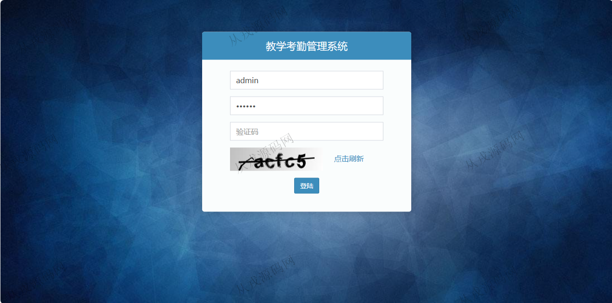

<h1 align="center">150.教学考勤管理系统</h1>

- <b>完整代码获取地址：从戎源码网 ([https://armycodes.com/](https://armycodes.com/))</b>
- <b>技术探讨、资料分享，请加QQ群：692619798</b> 
- <b>作者微信：19941326836  QQ：952045282</b> 
- <b>承接计算机毕业设计、Java毕业设计、Python毕业设计、深度学习、机器学习</b>
- <b>选题+开题报告+任务书+程序定制+安装调试+论文+答辩ppt 一条龙服务</b>
- <b>所有选题地址 ([https://github.com/YuLin-Coder/AllProjectCatalog](https://github.com/YuLin-Coder/AllProjectCatalog)) </b>

## 项目介绍
基于ssm的教学考勤管理系统：前端 html、jquery、bootstrap，后端 maven、springmvc、spring、mybatis；角色分为：管理员、老师、学生；集成教师管理、学生管理、考勤管理等功能于一体的系统。

## 功能介绍

- 教师管理：教师信息的增删改查
- 学生管理：学生信息的增删改查
- 站内消息：关键词搜索，发送信息，删除消息，查看消息详情，阅读状态（已读、未读）
- 通知公告：公告信息的增删改查
- 学生考勤：学生考勤信息的录入，关键词搜索，考勤的详情查看，考勤信息删除
- 教师考勤：教师考勤信息的录入，关键词搜索，考勤的详情查看，考勤信息删除
- 个人信息：个人信息查看与修改，密码修改

## 环境

- <b>IntelliJ IDEA 2021.3</b>

- <b>Mysql 5.7.26</b>

- <b>Tomcat 7.0.73</b>

- <b>JDK 1.8</b>

## 运行截图

